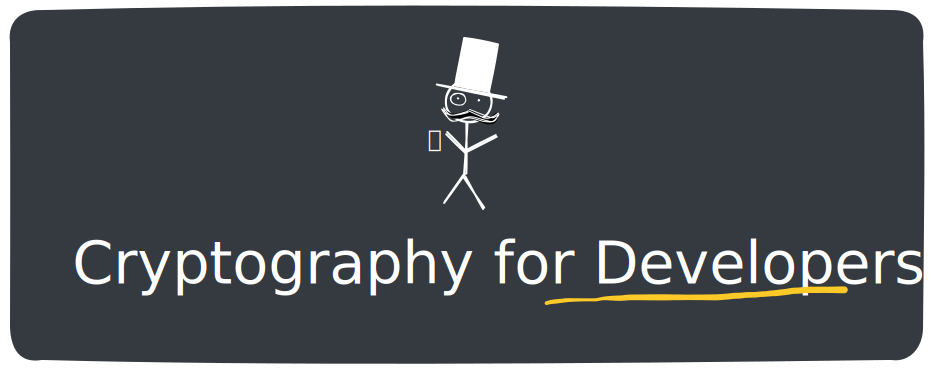
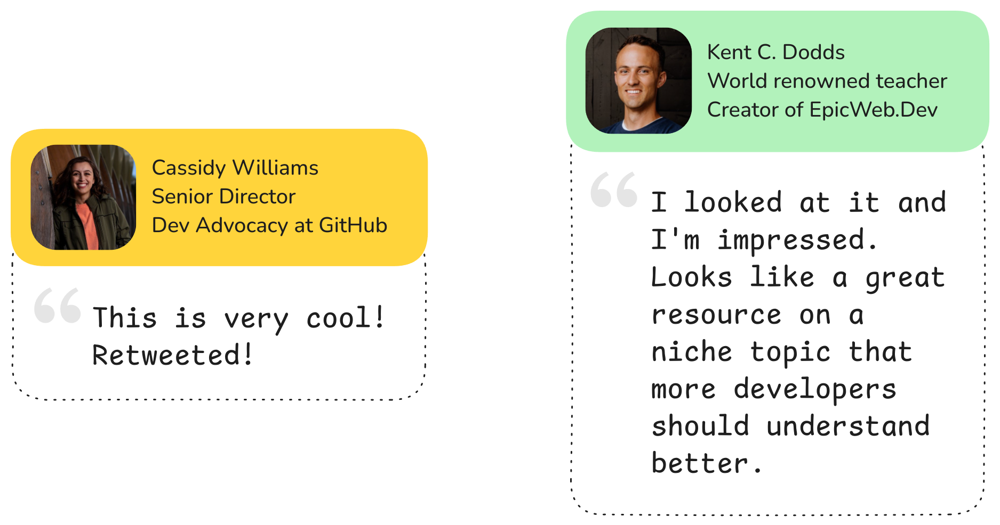

In regular programming courses, cryptography concepts are overlooked. In my initial days as a developer I saw various terms like -- `PBKDF-2, salt, key pairs, hashing`. I never really understood what do they mean deeply.

5 years back, I got a chance to help freeCodeCamp in <a target="_blank" href="https://github.com/freeCodeCamp/CurriculumExpansion/pull/184">creating a short course on public key cryptography</a> aimed at web developers.

That course gave me a chance to dive deep into these cryptography concepts.

So, I created this free course to share my learnings with all the developers curious to understand the <strong>cryptography concepts that are relevant to daily developer life.</strong>

**🟢 It's live on: https://cryptography-for-devs.github.io**

We have got some amazing feedback from [Cassidy Williams](https://x.com/cassidoo) and [Kent C. Dodds](https://twitter.com/kentcdodds)!

It fills my heart with joy to receive feedback from people I have admired all along.

## Course contents

I have tried covering developer-oriented cryptography concepts in an easy to follow manner.

If the first half proves valuable to lots of developers, then I will work hard on the second half based on developers' feedback.

All of this will remain free, forever! <a href="https://twitter.com/vkwebdev" target="_blank">You can follow me on Twitter</a>, there you will receive updates on future releases and my future projects. no BS.

#### Part 1 of 2:

<ol start="0">
    <li><a href="https://cryptography-for-devs.github.io/0-before-we-start/" target="_blank">Before we start (Do not skip this)</a></li>
    <li><a href="https://cryptography-for-devs.github.io/1-symmetric-key-encryption/" target="_blank">Symmetric key encryption</a></li>
    <li><a href="https://cryptography-for-devs.github.io/2-caesar-challenge/" target="_blank">Code challenge: Caesar's cipher</a></li>
    <li><a href="https://cryptography-for-devs.github.io/3-the-hash/" target="_blank">Cryptographic hash functions</a></li>
    <li><a href="https://cryptography-for-devs.github.io/4-revealed-passwords/" target="_blank">Password hashing</a></li>
    <li><a href="https://cryptography-for-devs.github.io/5-rainbows-and-salts/" target="_blank">Rainbow table and the salt</a></li>
    <li><a href="https://cryptography-for-devs.github.io/6-slow-them-down/" target="_blank">PBKDF-2: slowing down</a></li>
</ol>

#### Part 2 of 2:

7. The Diffie-Hellman key exchange
8. RSA public-key encryption
9. Challenge: End to end encryption
10. The TLS story
11. Certificate authorities rule!
12. Project: Finale.

## Contributing

There are two ways to contribute that I feel are going to be impactful:

- Improve the existing course content by submitting a PR.
- Create an issue and introduce yourself in that issue, if you would like to help me write one of the future lessons.

If you want to convey to me anything that isn't covered here, the best way is to send me an email on: <a href="mailto:vivekmittalagrawal@gmail.com">vivekmittalagrawal@gmail.com</a>
